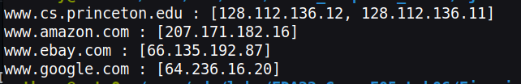
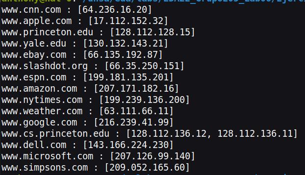

<table>
    <theader>
        <tr>
            <td></td>
            <th>
                UNIVERSIDAD NACIONAL DE SAN AGUSTIN 
                FACULTAD DE INGENIERÍA DE PRODUCCIÓN Y SERVICIOS 
                DEPARTAMENTO ACADÉMICO DE INGENIERÍA DE SISTEMAS E INFORMÁTICA 
                ESCUELA PROFESIONAL DE INGENIERÍA DE SISTEMAS
            </th>
            <td></td>
        </tr>
    </theader>
    <tbody>
        <tr><td colspan="3">Formato:Informe de Práctica de Laboratorio</td></tr>
        <tr><td>Aprobación:  2022/03/01</td><td>Código: GUIA-PRLD-001</td><td>Página: 1</td></tr>
    </tbody>
</table>

INFORME DE LABORATORIO 

<table>
<theader>
<tr><th colspan="6">INFORMACIÓN BÁSICA</th></tr>
</theader>
<tbody>
<tr><td>ASIGNATURA:</td><td colspan="5">Estructura de Datos y Algoritmos</td></tr>
<tr><td>TÍTULO DE LA PRÁCTICA:</td><td colspan="5"ÁRBOL B</td></tr>
<tr>
<td>NÚMERO DE PRÁCTICA:</td><td>06</td><td>AÑO LECTIVO:</td><td>2022 A</td><td>NRO. SEMESTRE:</td><td>III</td>
</tr>
<tr>
<td>FECHA DE PRESENTACIÓN:</td><td>07-Agosto-2022</td><td>HORA DE PRESENTACIÓN:</td><td colspan="3">23:55</td>
</tr>
<tr><td colspan="4">Integrantes:
        <ul>
            <li><h5>Escobar/Atamari, Diego Gabriel - descobara@unsa.edu.pe</h5></li>
            <li><h5>Flores/Sucapuca, Ervin Eleazar - efloressuc@unsa.edu.pe</h5></li>
            <li><h5>Machicao/Quispe, Gabriel Steven - gmachicaoq@unsa.edu.pe</h5></li>
            <li><h5>Moroccoire/Pacompia, Anthony Marcos - amoroccoire@unsa.edu.pe</h5></li>
            <li><h5>Quispe/Bejar, Garlet Analy - gquispeb@unsa.edu.pe</h5></li>
        </ul>
    </td>
    <td colspan="2">Nota:</td>
</<tr>
<tr><td colspan="6">DOCENTES:
<ul>
<li>Richart Smith Escobedo Quispe - rescobedoq@unsa.edu.pe</li>
</ul>
</td>
</<tr>
</tdbody>
</table>

<table>
    <theader>
        <tr><th colspan="6">EJERCICIOS PROPUESTOS</th></tr>
    </theader>
    <tbody>
        <tr><td colspan="6"> PREGUNTA 1
          <ul>
     	     <li> Modificar el método de obtención de valor dado una clave (5 puntos)
		<ul>
		    <li>
		    	RESPUESTA
			
En escencia se ha usado un HashMap cuya clave (key) es el sitio web y su valor es un ArrayList de String en donde se almacenaran los ip en caso de que coincida la direccion web asi como no, la siguiente imagen ilustra la intención: 

			
			
Para conseguir dicho objetivo, se ha inicializado un ArrayList de la siguiente manera: <code>ArrayList<String> sitiosWeb = new ArrayList<>(List.of(""www.cs.princeton.edu", "128.112.136.12", ...));</code>   La estructura que sigue es (Direccion web, IP)  Posterior a ello se crea un diccionario con los tipos de valor (String, ArrayList<String>) 

			
Para llenar el diccionario se usa un ciclo for y las iteraciones que debe hacer es n/2 donde n es el tamaño de la lista inicializada, para conocer la posicion del nombre de l apgina web el iterador (en codigo representado como "i") debe ser incializado en 0 y sigue el patron (2*i) y para conocer su IP es (2*i + 1), luego de obtener los valores respectivos son asignados a las variables de tipo String "dirección" e "ip"

			

			Se verifica que la clave (direccion web) no exista en el diccionario con el bloque if a través del metodo de la clase HashMap <code>containsKey(key)</code> si es verdadero, se procede agregar un nuevo elemento al diccionario cuya clave es la direccion web y su valor un arrayList vacio creado con la palabra reservada <code>new</code>. El paso 2 se da fuera del bloque if en el que se accede al valor de dicha clave con el metodo <code>get(key)</code> de la clase HashMap esto retornara un arrayList al que se le añadira la ip proporcionada con el método <code>add(value)</code> de la clase ArrayList. Si el bloque if resulta falso significa que ya existe la clave por lo tanto solo ignora el dicho bloque y pasa al paso 2
			

			

			Para probar el código se han hecho 2 test: Test 1
				<ul>
					<li>El test consiste en mostrar 4 direcciones web y sus respectivos ip </li> El test ha sido comentado en el codigo para poder pasar al segundo test
				</ul>
			

			

			Test 2
				<ul>
					<li>Consiste en mostrar todas las direcciones web de la lista de incializacion con sus respectivos ip  </li>
				</ul>
			Estre test se mostrara al ejecutar el ejercicio
			

			
Para ejecutar el código escriba los siguientes comandos: <code>javac Ejercicio1.java</code> <code>java Ejercicio1</code>

		    </li>
		</ul>             
	     </li>
	  </ul>
	</td></tr>
 	<tr><td colspan="6"> PREGUNTA 2
          <ul>
     	     <li> Mostrar en un diagrama de árbol gráficamente la estructura final para los datos ingresados. (4 puntos)
             <ul>
		  <li>En la siguiente imagen se muestra el arbol B final que se genera a partir de las insercciones anteriores https://ibb.co/txSrMHx.</li>
		  
		</ul> 
	     </li>
	  </ul>
	</td></tr>
 	<tr><td colspan="6"> PREGUNTA 3
          <ul>
     	     <li>El método toString() del árbol, retorna lo siguiente. ¿Por qué están entre paréntesis ciertas claves? (4 puntos)
                <ul>
		    <li>Es por que es una raíz.</li>
		    <li>else {
            for (int j = 0; j < h.m; j++) {
                if (j > 0) 
                	s.append(indent + "(" + children[j].key + ")\n");
                s.append(toString(children[j].next, ht-1, indent + "     "));
            }</li>
		    
		</ul> 
             </li>
	  </ul>
	</td></tr>
 	<tr><td colspan="6"> PREGUNTA 4
          <ul>
     	     <li>Mostrar paso a paso el arbol-B al eliminar " www.espn.com" (4 puntos)
                <ul>
		    <li> En la primera parte vemos como tenemos distribuido los elementos del árbol B que tenemos, en la cual se observa
		    en la siguiente imagen: 
		    
		    </li>
		    <li> Luego el elemento que se introduce se le compara con la raíz principal para luego indicar si se elimina el elemento
		    o que camino recorre para seguir buscando al elemento. 
		     
		     </li>
		    <li> Al ver que el valor es mayor que la raíz, se busca por el lado derecho donde se busca en el valores del nodo, 
		    si esta ahí el elemento que deseamos eliminar. 
		     
		     </li>
		     <li> Al no encontrar el elemento bajamos por el primer valor del nodo, ya que el valor que buscamos es menor y al llegar 
		     al siguiente nodo buscamos y se encuentra el valor solicitado.  
		      
		     </li>
		     <li> Al encontrar el valor se elimnina y en este caso no se hace una redistribución o Fusión de nodos, puesto que el no 
		     es menor a la mitad del grado mínimo. 
		      
		     </li>
		</ul> 
             </li>
	  </ul>
	</td></tr>
 	<tr><td colspan="6"> PREGUNTA 5
          <ul>
     	     <li>Agregar un nodo adicional (www.youtube.com, 134.24.13.78) y mostrarlo paso a paso. (3 puntos)
                 <ul>
		    <li>En esta primera imagen tenemos como esta distribuido el árbol antes de que se inserte el nuevo nodo.
			
	            </li>
		    <li>Una vez insertado el nodo con clave www.youtube.com se movera hacia el hijo derecho de la raíz para luego 
			moverse a la última clave, aquí nuevamente bajara al hijo derecho de la última clave y se moverá a la última posición. 
		        
	            </li> 
		    <li>Como el máximo de claves que puede haber es 3 (M-1) entonces se divide entre 2 y en este caso el nodo que 
			sube es www.yahoo.com despues www.weather.com pasar a ser un nodo solitario y los nodos www.yales.com y 
			www.youtube.com pasar a ser hijos derechos de www.yahoo.com.Pero ahora el hijo derecho de www.csprinceton.edu tienes 4 claves.
			
	            </li>
		    <li>Nuevamente se vuelve a dividir y en este caso www.princeton.com  es el que sube a la raíz y www.google.com pasar 
			a ser un nodo único cuyos hijos izquierdo y derecho mantiene, tanto www.slashdot.com y www.yahoo.com mantienen 
			sus hijos izquierdos y derechos.Asi finalmente se ha insertado www.youtube.com. 
			
	            </li>
		</ul> 
             </li>
	  </ul>
	</td></tr>
        <tr><td colspan="6"> CONCLUSIONES
           <li>El árbol B nos sirve para almacenar grandes cantidades de datos que no caben en la memoria principal, mientras minimiza la cantidad de accesos al disco</li>
		<li>
		Los arboles balanceados son una buena solución para implementar el manejo de índices asoaciados a archivos de datos.
		</li>
	</td></tr>
 </tbody>
</table>

<table>
    <theader>
        <tr><th>RETROALIMENTACIÓN</th></tr>
    </theader>
    <tbody>
         <tr><td colspan="6">                       </td></tr>
    </tbody>
</table>

<table>
    <theader>
        <tr><th>REFERENCIAS Y BIBLIOGRAFIA</th></tr>
    </theader>
    <tbody>
        <tr><td>
            <ul>
                <li>Weiss M., Data Structures & Algorithm Analysis Using Java, 2010, Addison-Wesley.</li>
                <li>Capítulo 4. Representación de conjuntos mediante arboles, Departamento de
Informática y Sistemas Área de Lenguajes y Sistemas, Universidad de Murcia, pag.168</li>
                <li>https://www.cs.usfca.edu/~galles/visualization/BTree.html</li>
                <li>https://ccia.ugr.es/~jfv/ed1/tedi/cdrom/docs/arb_B.htm</li>
            </ul></td>
        </tr>
    </tbody>
</table>
